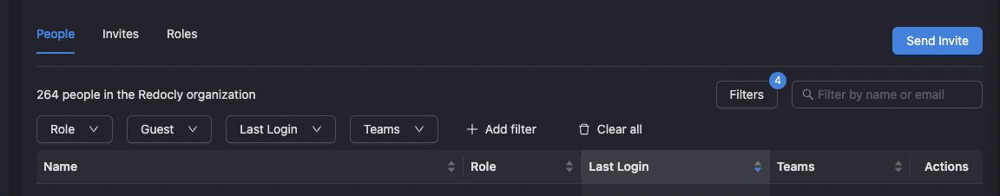

# Redocly Trial Day Exercise

Hey there! Welcome to the Redocly trial day exercise. We've put together this task to see your skills in action, particularly with Node.js, React, Prisma, and handling data. Let's build something cool!

**Goal:** The main goal is to build a functional "People Page" – think of a UI where you can see members of an organization, filter them, and sort them, all backed by API you'll create.

**Context:** Building intuitive tools for managing users, teams, and permissions is a big part of what we do. This task mirrors some of the real-world challenges involved in creating a smooth experience for listing and filtering people based on different attributes like their role, team membership, or activity.

**Inspiration:** We have a "People" view in our app. The image below shows the kind of filters and data typically displayed. Feel free to use it as a visual guide, but you have creative freedom on the exact UI implementation.



## Provided Setup

This repository includes:

*   A pre-defined Prisma schema (`prisma/schema.prisma`) modelling Users, Teams, and Memberships (please stick to this structure).
*   Configuration for using a **SQLite** database (`prisma/dev.db` - appears after setup).
*   A seed script (`prisma/seed.ts`) to populate the database with varied test data.
*   Basic scripts in `package.json` for common Prisma operations.

## Setup Instructions

First things first, let's get the database up and running:

1.  **Install dependencies**
    ```bash
    npm install
    ```

2.  **Generate Prisma Client** 
    ```bash
    npm run prisma:generate
    ```

3. **Create the SQLite database, apply the schema, and seed this with test data**
    ```bash
    npm run prisma:migrate
    ```

4.  **Optional: Re-seed the database with test data**
    ```bash
    npm run db:seed
    ```
    This populates `dev.db` with sample data (around 500 Users, 30 Teams, etc.) to work with.

## Exploring the Data (Optional but Handy!)

Getting familiar with the data models and sample data might be helpful before diving in.

### Using Prisma Studio

A visual GUI to browse your database:
```bash
npm run prisma:studio
```

### Using the Test Client

A simple script to fetch and log a few users and their related data (if you never worked with Prisma before, this script is a good way to see how it works):
```bash
npm run test:client
```

## Your Task: Build the People Page Feature

Build a full-stack feature that displays a list of organization members with filtering, sorting, and pagination.

**Core Requirements:**

1.  **Backend (Node.js):**
    *   Create a Node.js application (using Express, NestJS, Fastify, Koa, or your preferred framework/native modules).
    *   Use `@prisma/client` to interact with the seeded SQLite database based on the provided `schema.prisma`.
    *   Implement the necessary API logic to support the frontend's needs for fetching member data with filtering, sorting, and pagination applied.
    *   **Important Data Rule:** Only display users who have a corresponding record in the `Membership` table. If a user exists but isn't in `Membership`, they are not considered part of the organization for this list.

2.  **Frontend (React):**
    *   Create a React application (Vite, CRA, etc.).
    *   Use whatever UI library you want.
    *   Build a UI that displays the list of organization members.
    *   Each member displayed should show at least: **Name, Email, Role, Guest Status (true/false), Last Login Date, and associated Team Names**.
    *   Implement UI controls to allow users to:
        *   **Filter by:**
            *   `Role` (e.g., OWNER, MEMBER, VIEWER) - Allow selecting one or multiple.
            *   `Guest` status (true/false).
            *   `Teams` - Allow selecting one or multiple teams (show users in *any* selected team).
            *   Users with `No Team` assigned.
            *   Text `Search` (on Name or Email).
        *   **Sort by:**
            *   `Name` (asc/desc).
            *   `Email` (asc/desc).
            *   `Role` (asc/desc).
            *   `Last Login` date (asc/desc, handle users who haven't logged in).
            *   `Teams` (asc/desc based on team names - can be tricky!).
        *   **Paginate** through the results.

**Focus & Approach:**

*   Please use the provided **database schema structure** as is. Your focus should be on building the functionality on top of it.
*   **Functionality first:** Aim to get the core filtering, sorting, and display working. Don't worry excessively about perfecting every single edge case.
*   **Document edge cases:** If you identify a tricky edge case (e.g., complex filtering interaction) that you don't have time to fully resolve, please just leave a note about it in the README instead of spending too much time on it.
*   **AI Assistance:** Feel free to use AI coding tools! They are part of modern development. However, be mindful that integrating AI-generated code might sometimes require extra effort to ensure it fits the specific requirements and quality standards. This exercise is designed to be somewhat resistant to trivial AI solutions due to the specific data relationships and filter combinations.

## Technology Constraints & Flexibility

*   **Mandatory:** Node.js, Prisma, SQLite (using the provided schema), React.
*   **Your Choice:** Backend framework, React state management, UI component libraries, styling approach (functionality over beauty!).

## Deliverables

*   A link to a Git repository (e.g., GitHub, GitLab) containing your complete source code (backend and frontend).
*   This `README.md` file updated with:
    *   Clear instructions on how **you** intended the app to be run (e.g., `npm run start:backend`, `npm run start:frontend`).
    *   Any notes on assumptions made or known limitations/edge cases you didn't fully address.
    *   If you will have enough time you can drop a video with demo of the app on slack channel.

## Evaluation Criteria

We're keen to see your approach and how you think! We'll primarily look at:

*   **Problem Solving:** The ideas and logic used in your code, especially in the backend data fetching and filtering.
*   **Readability & Simplicity:** How clean, understandable, and maintainable your code is. We appreciate simplicity over unnecessary layers of abstraction.
*   **Functionality:** Does the core task work as expected?
*   **Prioritization & Delivery:** We value seeing the core feature working end-to-end. Please note any limitations or edge cases you didn't fully address rather than getting stuck, though polishing is great if time permits.


## Time & Help

*   **Time Limit:** Please aim to complete this by the end of your trial day with us.
*   **Questions?** If you run into any blockers or have questions about the requirements, please don't hesitate to ask us on the provided Slack channel!

We're excited to see what you build. Good luck and have fun!

---

## Implementation Notes

### How to Run

**Prerequisites:**
- Node.js 20+
- npm

**1. Setup the database (from root directory):**
```bash
cd backend
npm install
npm run prisma:generate
npm run prisma:migrate
```

**2. Start the backend (NestJS on port 3001):**
```bash
cd backend
npm run start:dev
```

**3. Start the frontend (Vite on port 5173):**
```bash
cd frontend
npm install
npm run dev
```

**4. Open the app:**
Navigate to `http://localhost:5173` in your browser.

### Tech Stack

- **Backend:** NestJS + Prisma + SQLite
- **Frontend:** React 19 + Vite + Ant Design + React Query + React Router

### API Endpoints

| Endpoint | Description |
|----------|-------------|
| `GET /api/members` | Fetch paginated members with filters and sorting |
| `GET /api/members/roles` | Get all available roles for filter dropdown |
| `GET /api/teams` | Get all teams for filter dropdown |

**Query Parameters for `/api/members`:**
- `page` - Page number (default: 1)
- `limit` - Items per page (default: 10, max: 100)
- `roles` - Comma-separated role names (e.g., `OWNER,MEMBER`)
- `isGuest` - `true` or `false`
- `teamIds` - Comma-separated team UUIDs
- `hasNoTeam` - `true` to filter users with no team
- `search` - Text search on name/email
- `sortBy` - `name`, `email`, `role`, `lastLoginAt`, `teams`
- `sortOrder` - `asc` or `desc`

---

## Design Decisions & Edge Cases

### 1. Membership-Only Rule
Only users with a corresponding `Membership` record are displayed. Users without membership (200 in the seed data) are excluded from all queries.

### 2. Teams Sorting Semantics
When sorting by teams:
- Users are sorted by their **first team name** (alphabetically).
- Users with **no teams** are placed **last** for ascending sort, **first** for descending sort.

### 3. Guest Filter UI Labels
The Guest filter shows "Guests" vs "Members" labels. Note that "Members" here refers to non-guest organization members (not the MEMBER role).

### 4. Total Members Count
The header always shows the total number of members in the organization, regardless of active filters. The pagination shows the filtered count.

---

## Known Limitations

### 1. Role and Teams Sorting (Page-Level Only)
Sorting by Role and Teams is performed **in-memory after fetching** the current page. This means:
- Sorting works correctly **within** the current page
- Sorting is **not globally correct** across all pages with pagination

**Why:** Prisma's `orderBy` cannot express JOINs on related tables (Membership for role, TeamUser for teams). A proper fix would require raw SQL queries.

**Example:** If sorting by Role ascending with 50 pages, page 2 may not contain the "next" roles after page 1 globally - it will have page 2 of name-sorted results, then sorted by role within that page.

### 2. Team Filter + No Team Filter Interaction
When both `teamIds` and `hasNoTeam` are active, they use **AND logic**, which typically returns empty results (a user cannot both be in a team AND have no team).

**Better approach:** Use OR logic to show users in selected teams OR users with no team.
